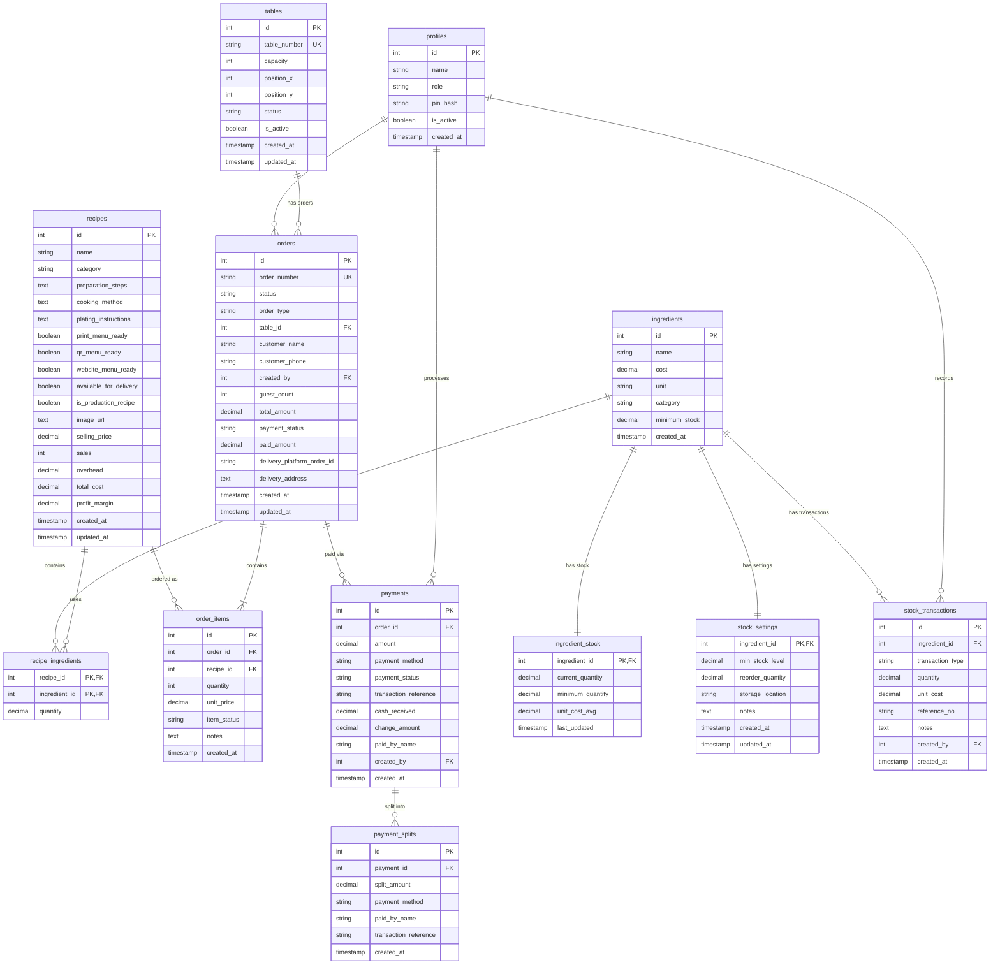

# Database Schema Documentation

Complete database schema for the ConsciousManager (Conscious Cafe) application.

## Entity Relationship Diagram



---

## Detailed Table Schemas

### 1. Core Recipe Management

#### **ingredients**
Stores all ingredient master data including costs and minimum stock levels.

| Column | Type | Constraints | Description |
|--------|------|-------------|-------------|
| id | SERIAL | PRIMARY KEY | Auto-incrementing ID |
| name | VARCHAR(255) | NOT NULL | Ingredient name |
| cost | DECIMAL(10,2) | NOT NULL | Cost per unit |
| unit | VARCHAR(50) | NOT NULL | Unit of measurement (kg, L, pcs, etc.) |
| category | VARCHAR(100) | | Ingredient category |
| minimum_stock | DECIMAL(10,2) | NOT NULL, DEFAULT 10 | Minimum stock threshold |
| created_at | TIMESTAMP | DEFAULT CURRENT_TIMESTAMP | Creation timestamp |

**Indexes:**
- `idx_ingredients_name` on name
- `idx_ingredients_category` on category
- `idx_ingredients_minimum_stock` on minimum_stock

---

#### **recipes**
Complete recipe information including menu availability, pricing, and profitability metrics.

| Column | Type | Constraints | Description |
|--------|------|-------------|-------------|
| id | SERIAL | PRIMARY KEY | Auto-incrementing ID |
| name | VARCHAR(255) | NOT NULL | Recipe name |
| category | VARCHAR(100) | DEFAULT 'Uncategorized' | Recipe category |
| preparation_steps | TEXT | | Preparation instructions |
| cooking_method | TEXT | | Cooking instructions |
| plating_instructions | TEXT | | Plating instructions |
| chefs_notes | TEXT | | Chef's notes |
| print_menu_ready | BOOLEAN | DEFAULT false | Ready for print menu |
| qr_menu_ready | BOOLEAN | DEFAULT false | Ready for QR menu |
| website_menu_ready | BOOLEAN | DEFAULT false | Ready for website menu |
| available_for_delivery | BOOLEAN | DEFAULT false | Available for delivery |
| is_production_recipe | BOOLEAN | DEFAULT true | Available in POS (vs internal prep) |
| delivery_image_url | TEXT | | Image for delivery platforms |
| image_url | TEXT | | Main recipe image |
| selling_price | DECIMAL(10,2) | DEFAULT 0 | Selling price |
| sales | INTEGER | DEFAULT 0 | Total sales count |
| overhead | DECIMAL(5,2) | DEFAULT 10 | Overhead percentage |
| total_cost | DECIMAL(10,2) | DEFAULT 0 | Total ingredient cost |
| profit_margin | DECIMAL(5,2) | DEFAULT 0 | Profit margin percentage |
| revenue | DECIMAL(10,2) | DEFAULT 0 | Total revenue |
| profit | DECIMAL(10,2) | DEFAULT 0 | Total profit |
| markup_factor | DECIMAL(5,2) | DEFAULT 0 | Markup factor |
| created_at | TIMESTAMP | DEFAULT CURRENT_TIMESTAMP | Creation timestamp |
| updated_at | TIMESTAMP | DEFAULT CURRENT_TIMESTAMP | Last update timestamp |

**Indexes:**
- `idx_recipes_name` on name
- `idx_recipes_category` on category
- `idx_recipes_created_at` on created_at
- `idx_recipes_is_production` on is_production_recipe

**Triggers:**
- `update_recipes_updated_at` - Auto-updates updated_at on changes

---

#### **recipe_ingredients**
Junction table linking recipes to ingredients with quantities.

| Column | Type | Constraints | Description |
|--------|------|-------------|-------------|
| recipe_id | INTEGER | PRIMARY KEY, FOREIGN KEY → recipes(id) | Recipe reference |
| ingredient_id | INTEGER | PRIMARY KEY, FOREIGN KEY → ingredients(id) | Ingredient reference |
| quantity | DECIMAL(10,2) | NOT NULL | Quantity needed |

**Composite Primary Key:** (recipe_id, ingredient_id)

**Indexes:**
- `idx_recipe_ingredients_recipe_id` on recipe_id
- `idx_recipe_ingredients_ingredient_id` on ingredient_id

**Cascading:** ON DELETE CASCADE (deleting recipe removes all links)

---

### 2. User Management

#### **profiles**
User accounts with role-based access control and PIN authentication.

| Column | Type | Constraints | Description |
|--------|------|-------------|-------------|
| id | SERIAL | PRIMARY KEY | Auto-incrementing ID |
| name | VARCHAR(255) | NOT NULL | User display name |
| role | VARCHAR(20) | NOT NULL, CHECK | Role: admin, server, kitchen, store_manager |
| pin_hash | VARCHAR(255) | NOT NULL | Bcrypt hashed PIN |
| is_active | BOOLEAN | DEFAULT true | Account active status |
| created_at | TIMESTAMP | DEFAULT CURRENT_TIMESTAMP | Creation timestamp |

**Indexes:**
- `idx_profiles_role` on role
- `idx_profiles_is_active` on is_active

**Default Users:**
- Admin (PIN: 0000)
- Server (PIN: 1111)
- Kitchen (PIN: 2222)
- Store Manager (PIN: 3333)

---

### 3. Order Management (POS/KDS)

#### **orders**
Main order tracking table for all order types.

| Column | Type | Constraints | Description |
|--------|------|-------------|-------------|
| id | SERIAL | PRIMARY KEY | Auto-incrementing ID |
| order_number | VARCHAR(50) | UNIQUE, NOT NULL | Auto-generated (ORD-001, ORD-002) |
| status | VARCHAR(20) | NOT NULL, DEFAULT 'pending', CHECK | pending, cooking, ready, served, cancelled |
| order_type | VARCHAR(20) | NOT NULL, CHECK | dine-in, swiggy, zomato, takeaway |
| table_id | INTEGER | FOREIGN KEY → tables(id) | Table reference (nullable) |
| table_number | VARCHAR(20) | | Legacy table number |
| customer_name | VARCHAR(255) | | Customer name |
| customer_phone | VARCHAR(20) | | Customer phone |
| created_by | INTEGER | FOREIGN KEY → profiles(id) | User who created order |
| guest_count | INTEGER | DEFAULT 1 | Number of guests |
| total_amount | DECIMAL(10,2) | DEFAULT 0 | Total order amount |
| payment_status | VARCHAR(20) | DEFAULT 'unpaid', CHECK | unpaid, partial, paid |
| paid_amount | DECIMAL(10,2) | DEFAULT 0 | Amount paid so far |
| delivery_platform_order_id | VARCHAR(100) | | External platform order ID |
| delivery_address | TEXT | | Delivery address |
| notes | TEXT | | Order notes |
| bill_generated_at | TIMESTAMP | | Bill generation time |
| created_at | TIMESTAMP | DEFAULT CURRENT_TIMESTAMP | Creation timestamp |
| updated_at | TIMESTAMP | DEFAULT CURRENT_TIMESTAMP | Last update timestamp |

**Indexes:**
- `idx_orders_status` on status
- `idx_orders_order_type` on order_type
- `idx_orders_created_by` on created_by
- `idx_orders_created_at` on created_at DESC
- `idx_orders_order_number` on order_number
- `idx_orders_table_id` on table_id
- `idx_orders_payment_status` on payment_status
- `idx_orders_platform_order_id` on delivery_platform_order_id

**Triggers:**
- `trigger_set_order_number` - Auto-generates order number
- `update_orders_updated_at` - Auto-updates updated_at
- `trigger_update_table_status` - Updates table status based on order

---

#### **order_items**
Individual items within an order.

| Column | Type | Constraints | Description |
|--------|------|-------------|-------------|
| id | SERIAL | PRIMARY KEY | Auto-incrementing ID |
| order_id | INTEGER | NOT NULL, FOREIGN KEY → orders(id) | Order reference |
| recipe_id | INTEGER | NOT NULL, FOREIGN KEY → recipes(id) | Recipe reference |
| quantity | INTEGER | NOT NULL, CHECK > 0 | Item quantity |
| unit_price | DECIMAL(10,2) | NOT NULL | Price at time of order |
| item_status | VARCHAR(20) | DEFAULT 'pending', CHECK | pending, preparing, ready |
| notes | TEXT | | Item-specific notes |
| created_at | TIMESTAMP | DEFAULT CURRENT_TIMESTAMP | Creation timestamp |

**Indexes:**
- `idx_order_items_order_id` on order_id
- `idx_order_items_recipe_id` on recipe_id
- `idx_order_items_status` on item_status

**Cascading:** ON DELETE CASCADE (deleting order removes all items)

---

### 4. Table Management

#### **tables**
Physical table layout and status tracking.

| Column | Type | Constraints | Description |
|--------|------|-------------|-------------|
| id | SERIAL | PRIMARY KEY | Auto-incrementing ID |
| table_number | VARCHAR(10) | NOT NULL, UNIQUE | Table number/name |
| capacity | INTEGER | NOT NULL, DEFAULT 4 | Guest capacity |
| position_x | INTEGER | DEFAULT 0 | X position for layout |
| position_y | INTEGER | DEFAULT 0 | Y position for layout |
| status | VARCHAR(20) | DEFAULT 'available', CHECK | available, occupied, billing, billed, reserved |
| is_active | BOOLEAN | DEFAULT true | Table active status |
| created_at | TIMESTAMP | DEFAULT CURRENT_TIMESTAMP | Creation timestamp |
| updated_at | TIMESTAMP | DEFAULT CURRENT_TIMESTAMP | Last update timestamp |

**Indexes:**
- `idx_tables_status` on status
- `idx_tables_is_active` on is_active

**Triggers:**
- `update_tables_updated_at` - Auto-updates updated_at

**Default Tables:** 20 tables pre-seeded (1-20)

---

### 5. Payment Management

#### **payments**
Payment records for orders (supports multiple payments per order).

| Column | Type | Constraints | Description |
|--------|------|-------------|-------------|
| id | SERIAL | PRIMARY KEY | Auto-incrementing ID |
| order_id | INTEGER | NOT NULL, FOREIGN KEY → orders(id) | Order reference |
| amount | DECIMAL(10,2) | NOT NULL, CHECK > 0 | Payment amount |
| payment_method | VARCHAR(20) | NOT NULL, CHECK | cash, card, upi |
| payment_status | VARCHAR(20) | DEFAULT 'pending', CHECK | pending, completed, failed, refunded |
| transaction_reference | VARCHAR(255) | | External transaction ID |
| cash_received | DECIMAL(10,2) | | Cash received (for cash payments) |
| change_amount | DECIMAL(10,2) | | Change given |
| paid_by_name | VARCHAR(255) | | Name of payer |
| notes | TEXT | | Payment notes |
| created_by | INTEGER | FOREIGN KEY → profiles(id) | User who processed payment |
| created_at | TIMESTAMP | DEFAULT CURRENT_TIMESTAMP | Creation timestamp |

**Indexes:**
- `idx_payments_order_id` on order_id
- `idx_payments_status` on payment_status
- `idx_payments_method` on payment_method
- `idx_payments_created_at` on created_at DESC

**Cascading:** ON DELETE CASCADE (deleting order removes all payments)

---

#### **payment_splits**
Individual payment splits for shared bills.

| Column | Type | Constraints | Description |
|--------|------|-------------|-------------|
| id | SERIAL | PRIMARY KEY | Auto-incrementing ID |
| payment_id | INTEGER | NOT NULL, FOREIGN KEY → payments(id) | Payment reference |
| split_amount | DECIMAL(10,2) | NOT NULL, CHECK > 0 | Split amount |
| payment_method | VARCHAR(20) | NOT NULL, CHECK | cash, card, upi |
| paid_by_name | VARCHAR(255) | | Name of payer |
| transaction_reference | VARCHAR(255) | | External transaction ID |
| notes | TEXT | | Split notes |
| created_at | TIMESTAMP | DEFAULT CURRENT_TIMESTAMP | Creation timestamp |

**Indexes:**
- `idx_payment_splits_payment_id` on payment_id

**Cascading:** ON DELETE CASCADE (deleting payment removes all splits)

---

### 6. Stock Management

#### **stock_transactions**
Audit trail of all stock movements.

| Column | Type | Constraints | Description |
|--------|------|-------------|-------------|
| id | SERIAL | PRIMARY KEY | Auto-incrementing ID |
| ingredient_id | INTEGER | NOT NULL, FOREIGN KEY → ingredients(id) | Ingredient reference |
| transaction_type | VARCHAR(50) | NOT NULL, CHECK | purchase, adjustment, wastage, usage |
| quantity | DECIMAL(10,2) | NOT NULL | Quantity change |
| unit_cost | DECIMAL(10,2) | | Cost per unit (for purchases) |
| reference_no | VARCHAR(100) | | Invoice/reference number |
| notes | TEXT | | Transaction notes |
| created_by | INTEGER | FOREIGN KEY → profiles(id) | User who created transaction |
| created_at | TIMESTAMP | DEFAULT CURRENT_TIMESTAMP | Creation timestamp |

**Indexes:**
- `idx_stock_transactions_ingredient` on ingredient_id
- `idx_stock_transactions_type` on transaction_type
- `idx_stock_transactions_created_at` on created_at DESC

**Triggers:**
- `trigger_update_stock_after_transaction` - Updates ingredient_stock automatically

**Cascading:** ON DELETE CASCADE (deleting ingredient removes all transactions)

---

#### **ingredient_stock**
Current stock levels for each ingredient.

| Column | Type | Constraints | Description |
|--------|------|-------------|-------------|
| ingredient_id | INTEGER | PRIMARY KEY, FOREIGN KEY → ingredients(id) | Ingredient reference |
| current_quantity | DECIMAL(10,2) | NOT NULL, DEFAULT 0 | Current stock quantity |
| minimum_quantity | DECIMAL(10,2) | | Minimum stock threshold |
| unit_cost_avg | DECIMAL(10,2) | | Average purchase cost |
| last_updated | TIMESTAMP | DEFAULT CURRENT_TIMESTAMP | Last update timestamp |

**Indexes:**
- `idx_ingredient_stock_quantity` on current_quantity

**Auto-updated:** Via triggers on stock_transactions

**Cascading:** ON DELETE CASCADE (deleting ingredient removes stock record)

---

#### **stock_settings**
Ingredient-specific inventory settings.

| Column | Type | Constraints | Description |
|--------|------|-------------|-------------|
| ingredient_id | INTEGER | PRIMARY KEY, FOREIGN KEY → ingredients(id) | Ingredient reference |
| min_stock_level | DECIMAL(10,2) | DEFAULT 10 | Minimum stock level |
| reorder_quantity | DECIMAL(10,2) | DEFAULT 50 | Reorder quantity |
| storage_location | VARCHAR(255) | | Storage location |
| notes | TEXT | | Settings notes |
| created_at | TIMESTAMP | DEFAULT CURRENT_TIMESTAMP | Creation timestamp |
| updated_at | TIMESTAMP | DEFAULT CURRENT_TIMESTAMP | Last update timestamp |

**Triggers:**
- `trigger_update_stock_settings_updated_at` - Auto-updates updated_at
- `trigger_sync_minimum_stock` - Syncs with ingredients.minimum_stock

**Cascading:** ON DELETE CASCADE (deleting ingredient removes settings)

---

## Key Features

### 🔄 Automatic Triggers

1. **Order Number Generation** - Auto-generates sequential order numbers (ORD-001, ORD-002, etc.)
2. **Table Status Updates** - Tables automatically update status based on order status
3. **Stock Level Updates** - Stock quantities update automatically on transactions
4. **Timestamp Management** - `updated_at` fields auto-update on changes
5. **Stock Initialization** - New ingredients automatically create stock and settings records

### 🔐 Security

- **Row Level Security (RLS)** - Enabled on all tables
- **PIN Authentication** - Bcrypt hashed PINs for user authentication
- **Audit Trail** - `created_by` fields track user actions
- **Public Policies** - Currently set for development (should be restricted in production)

### 📊 Calculated Fields

- **Recipe Profitability** - `total_cost`, `profit_margin`, `revenue`, `profit` auto-calculated
- **Average Costs** - `unit_cost_avg` calculated from purchase transactions
- **Payment Totals** - `paid_amount` tracked across multiple payments

### 🔗 Cascading Deletes

- Deleting a **recipe** removes all `recipe_ingredients`
- Deleting an **order** removes all `order_items` and `payments`
- Deleting an **ingredient** removes `ingredient_stock`, `stock_settings`, and `stock_transactions`
- Deleting a **payment** removes all `payment_splits`

---

## Database Statistics

- **Total Tables:** 15
- **Junction Tables:** 1 (recipe_ingredients)
- **Lookup Tables:** 2 (tables, profiles)
- **Transaction Tables:** 4 (orders, order_items, payments, stock_transactions)
- **State Tables:** 2 (ingredient_stock, stock_settings)
- **Core Tables:** 2 (ingredients, recipes)
- **Split Tables:** 1 (payment_splits)

---

## Helper Functions

### Authentication
- `verify_pin(input_pin TEXT)` - Verifies PIN and returns user profile

### Order Statistics
- `get_order_stats()` - Returns overall order statistics
- `get_order_stats_by_type()` - Returns statistics grouped by order type
- `get_orders_by_type(type_param VARCHAR)` - Returns orders filtered by type

### Table Management
- `get_table_with_order(table_id_param INTEGER)` - Returns table with current order
- `update_table_status_from_order()` - Trigger function to update table status

### Payment
- `get_order_payment_summary(order_id_param INTEGER)` - Returns payment summary for order

### Stock Management
- `update_stock_after_transaction()` - Trigger function to update stock levels
- `initialize_stock_for_new_ingredient()` - Trigger function for new ingredients
- `sync_minimum_stock_on_ingredient_update()` - Syncs minimum stock across tables

---

## Migration Files

1. `20240101000000_initial_schema.sql` - Core recipe management tables
2. `20240101000001_storage_bucket.sql` - Supabase storage setup
3. `20240101000002_pos_kds_system.sql` - POS/KDS and user management
4. `20240101000003_add_store_manager_role.sql` - Store manager role
5. `20240101000004_table_payment_system.sql` - Table and payment management
6. `20240101000005_add_delivery_platforms.sql` - Delivery platform support
7. `20251214234643_add_recipe_type.sql` - Production recipe flag
8. `20251215093144_stock_management.sql` - Stock management system
9. `20251215120000_add_minimum_stock_to_ingredients.sql` - Minimum stock on ingredients

---

## Quick Reference

### Order Status Flow
```
pending → cooking → ready → served
                    ↓
                cancelled
```

### Payment Status Flow
```
unpaid → partial → paid
```

### Table Status Flow
```
available → occupied → billing → billed → available
```

### Item Status Flow
```
pending → preparing → ready
```

---

**Last Updated:** 2025-12-16  
**Database Version:** PostgreSQL 14+ (Supabase)  
**Total Migrations:** 9
